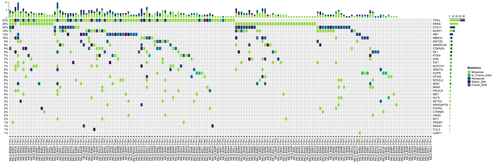
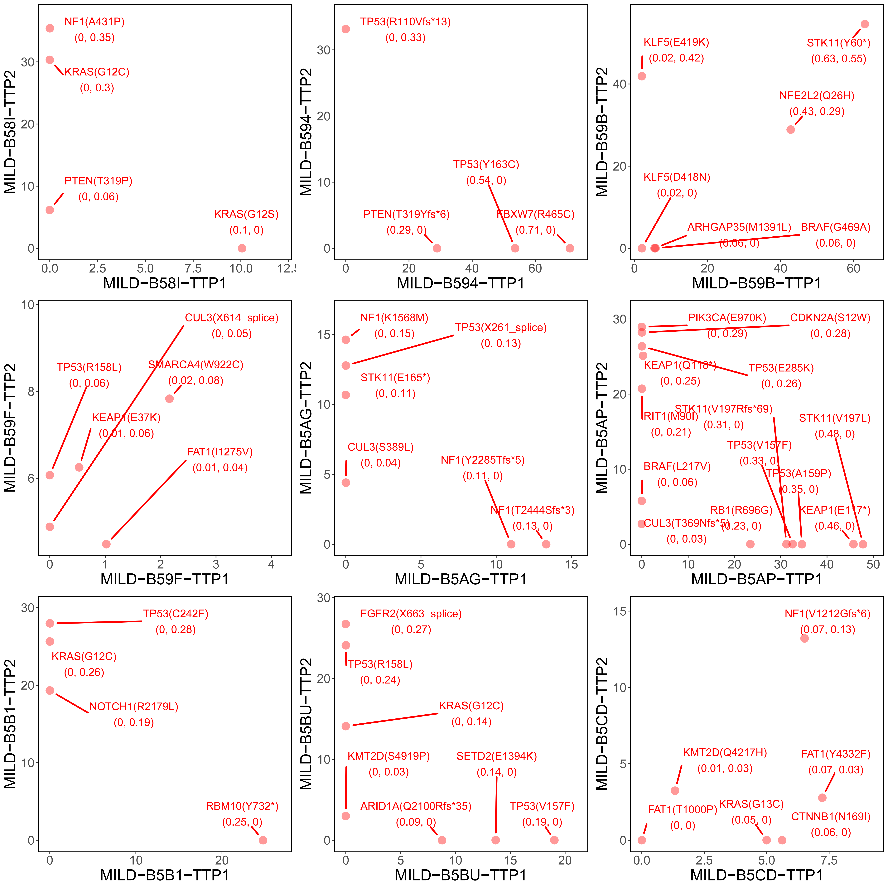

# 🧬 Genoviz

**Genoviz** is a lightweight toolkit for visualizing somatic mutation patterns in cancer cohorts. It provides an easy-to-run shell script pipeline to extract driver mutations from MAF files, format them, and generate mutation landscape plots and VAF-based comparisons.

---

## 📂 Repository Structure

```
genoviz/
├── oncoplot/              # Mutation landscape plotting scripts and data
├── vaf_comparison/        # VAF comparison analysis and plots
├── images/                # Output visualizations (see below)
└── README.md              # Project documentation
```

---

## ⚙️ Key Features

- Extracts **non-silent somatic mutations** from MAF files
- Focuses on a **user-specified list of SMGs (Significantly Mutated Genes)**
- Generates **oncoplots** with labeled mutation types per sample
- Provides **VAF correlation plots** for comparative analysis

---

## 🚀 Usage

To run the mutation landscape pipeline:

```bash
bash run_oncoplot.sh --maf your_input.maf --smg smg_list.txt --pdf output_plot.pdf
```

- `--maf`: Input annotated MAF file
- `--smg`: A plain-text list of SMG gene symbols, one per line
- `--pdf`: Output file name for the generated oncoplot (PDF)

Make sure the script `summary.somatic.alter.v3.r` is in your working directory.

---

## 🖼️ Example Plots

### 🔬 Somatic Mutation Landscape (Clinical Samples)


---

### 🧬 Somatic Mutation Landscape (New Samples)



---

### 📈 VAF Correlation Plot

This plot compares variant allele frequencies between sample groups.



---

## 🙋‍♂️ Contact

For questions, please contact **syingduo** via GitHub or open an issue.

